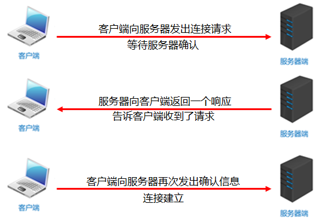
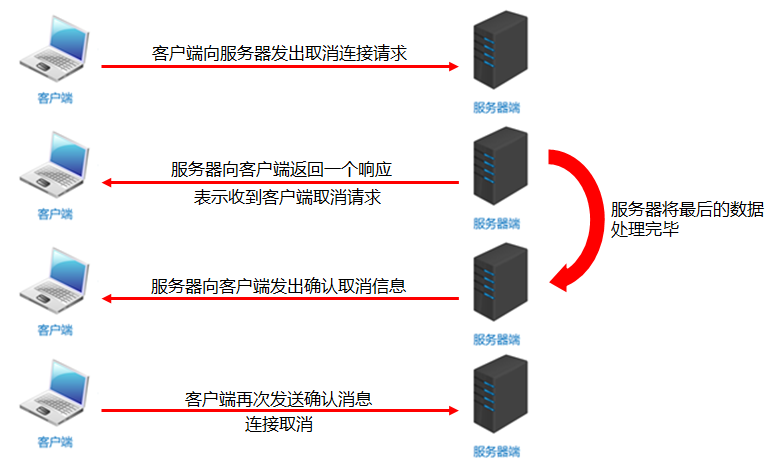
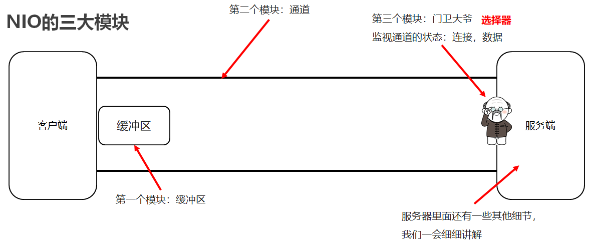
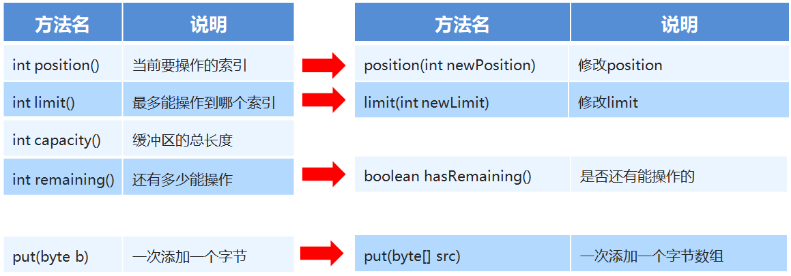

## 1.网络编程入门

### 1.1 网络编程概述【理解】

- 计算机网络

  是指将地理位置不同的具有独立功能的多台计算机及其外部设备，通过通信线路连接起来，在网络操作系统，网络管理软件及网络通信协议的管理和协调下，实现资源共享和信息传递的计算机系统

- 网络编程

  在网络通信协议下，不同计算机上运行的程序，可以进行数据传输

### 1.2 网络编程三要素【理解】

- IP地址

  要想让网络中的计算机能够互相通信，必须为每台计算机指定一个标识号，通过这个标识号来指定要接收数据的计算机和识别发送的计算机，而IP地址就是这个标识号。也就是设备的标识

- 端口

  网络的通信，本质上是两个应用程序的通信。每台计算机都有很多的应用程序，那么在网络通信时，如何区分这些应用程序呢？如果说IP地址可以唯一标识网络中的设备，那么端口号就可以唯一标识设备中的应用程序了。也就是应用程序的标识

- 协议

  通过计算机网络可以使多台计算机实现连接，位于同一个网络中的计算机在进行连接和通信时需要遵守一定的规则，这就好比在道路中行驶的汽车一定要遵守交通规则一样。在计算机网络中，这些连接和通信的规则被称为网络通信协议，它对数据的传输格式、传输速率、传输步骤等做了统一规定，通信双方必须同时遵守才能完成数据交换。常见的协议有UDP协议和TCP协议

### 1.3 IP地址【理解】

IP地址：是网络中设备的唯一标识

- IP地址分为两大类

  - IPv4：是给每个连接在网络上的主机分配一个32bit地址。按照TCP/IP规定，IP地址用二进制来表示，每个IP地址长32bit，也就是4个字节。例如一个采用二进制形式的IP地址是“11000000 10101000 00000001 01000010”，这么长的地址，处理起来也太费劲了。为了方便使用，IP地址经常被写成十进制的形式，中间使用符号“.”分隔不同的字节。于是，上面的IP地址可以表示为“192.168.1.66”。IP地址的这种表示法叫做“点分十进制表示法”，这显然比1和0容易记忆得多

  - IPv6：由于互联网的蓬勃发展，IP地址的需求量愈来愈大，但是网络地址资源有限，使得IP的分配越发紧张。为了扩大地址空间，通过IPv6重新定义地址空间，采用128位地址长度，每16个字节一组，分成8组十六进制数，这样就解决了网络地址资源数量不够的问题

- DOS常用命令：

  - ipconfig：查看本机IP地址

  - ping IP地址：检查网络是否连通

- 特殊IP地址：
  - 127.0.0.1：是回送地址，可以代表本机地址，一般用来测试使用

### 1.4 InetAddress【应用】

InetAddress：此类表示Internet协议（IP）地址

- 相关方法

  | 方法名                                      | 说明                               |
  | -————————————— | ——————————— |
  | static InetAddress getByName(String host) | 确定主机名称的IP地址。主机名称可以是机器名称，也可以是IP地址 |
  | String getHostName()                     | 获取此IP地址的主机名                      |
  | String getHostAddress()                  | 返回文本显示中的IP地址字符串                  |

- 代码演示

  ```java
  public class InetAddressDemo {
      public static void main(String[] args) throws UnknownHostException {
  		//InetAddress address = InetAddress.getByName(“itheima”);
          InetAddress address = InetAddress.getByName(“192.168.1.66”);

          //public String getHostName()：获取此IP地址的主机名
          String name = address.getHostName();
          //public String getHostAddress()：返回文本显示中的IP地址字符串
          String ip = address.getHostAddress();

          System.out.println(“主机名：” + name);
          System.out.println(“IP地址：” + ip);
      }
  }
  ```


### 1.5 端口和协议【理解】

- 端口

  - 设备上应用程序的唯一标识

- 端口号

  - 用两个字节表示的整数，它的取值范围是0~65535。其中，0~1023之间的端口号用于一些知名的网络服务和应用，普通的应用程序需要使用1024以上的端口号。如果端口号被另外一个服务或应用所占用，会导致当前程序启动失败

- 协议

  - 计算机网络中，连接和通信的规则被称为网络通信协议

- UDP协议
  - 用户数据报协议(User Datagram Protocol)
  - UDP是无连接通信协议，即在数据传输时，数据的发送端和接收端不建立逻辑连接。简单来说，当一台计算机向另外一台计算机发送数据时，发送端不会确认接收端是否存在，就会发出数据，同样接收端在收到数据时，也不会向发送端反馈是否收到数据。
  - 由于使用UDP协议消耗系统资源小，通信效率高，所以通常都会用于音频、视频和普通数据的传输
  - 例如视频会议通常采用UDP协议，因为这种情况即使偶尔丢失一两个数据包，也不会对接收结果产生太大影响。但是在使用UDP协议传送数据时，由于UDP的面向无连接性，不能保证数据的完整性，因此在传输重要数据时不建议使用UDP协议

- TCP协议

  - 传输控制协议 (Transmission Control Protocol)

  - TCP协议是面向连接的通信协议，即传输数据之前，在发送端和接收端建立逻辑连接，然后再传输数据，它提供了两台计算机之间可靠无差错的数据传输。在TCP连接中必须要明确客户端与服务器端，由客户端向服务端发出连接请求，每次连接的创建都需要经过“三次握手”

  - 三次握手：TCP协议中，在发送数据的准备阶段，客户端与服务器之间的三次交互，以保证连接的可靠

    第一次握手，客户端向服务器端发出连接请求，等待服务器确认

    第二次握手，服务器端向客户端回送一个响应，通知客户端收到了连接请求

    第三次握手，客户端再次向服务器端发送确认信息，确认连接

  - 完成三次握手，连接建立后，客户端和服务器就可以开始进行数据传输了。由于这种面向连接的特性，TCP协议可以保证传输数据的安全，所以应用十分广泛。例如上传文件、下载文件、浏览网页等

## 2.UDP通信程序

### 2.1 UDP发送数据【应用】

- Java中的UDP通信
  - UDP协议是一种不可靠的网络协议，它在通信的两端各建立一个Socket对象，但是这两个Socket只是发送，接收数据的对象，因此对于基于UDP协议的通信双方而言，没有所谓的客户端和服务器的概念
  - Java提供了DatagramSocket类作为基于UDP协议的Socket

- 构造方法

  | 方法名                                      | 说明                           |
  | -————————————— | -————————— |
  | DatagramSocket()                         | 创建数据报套接字并将其绑定到本机地址上的任何可用端口   |
  | DatagramPacket(byte[] buf,int len,InetAddress add,int port) | 创建数据包,发送长度为len的数据包到指定主机的指定端口 |

- 相关方法

  | 方法名                            | 说明          |
  | —————————— | ———— |
  | void send(DatagramPacket p)    | 发送数据报包      |
  | void close()                   | 关闭数据报套接字    |
  | void receive(DatagramPacket p) | 从此套接字接受数据报包 |

- 发送数据的步骤
  - 创建发送端的Socket对象(DatagramSocket)
  - 创建数据，并把数据打包
  - 调用DatagramSocket对象的方法发送数据
  - 关闭发送端

- 代码演示

  ```java
  public class SendDemo {
      public static void main(String[] args) throws IOException {
          //创建发送端的Socket对象(DatagramSocket)
          // DatagramSocket() 构造数据报套接字并将其绑定到本地主机上的任何可用端口
          DatagramSocket ds = new DatagramSocket();

          //创建数据，并把数据打包
          //DatagramPacket(byte[] buf, int length, InetAddress address, int port)
          //构造一个数据包，发送长度为 length的数据包到指定主机上的指定端口号。
          byte[] bys = “hello,udp,我来了”.getBytes();

          DatagramPacket dp = new DatagramPacket(bys,bys.length,InetAddress.getByName(“127.0.0.1”),10086);

          //调用DatagramSocket对象的方法发送数据
          //void send(DatagramPacket p) 从此套接字发送数据报包
          ds.send(dp);

          //关闭发送端
          //void close() 关闭此数据报套接字
          ds.close();
      }
  }
  ```

### 2.2UDP接收数据【应用】

- 接收数据的步骤
  - 创建接收端的Socket对象(DatagramSocket)
  - 创建一个数据包，用于接收数据
  - 调用DatagramSocket对象的方法接收数据
  - 解析数据包，并把数据在控制台显示
  - 关闭接收端

- 构造方法

  | 方法名                                 | 说明                               |
  | ———————————— | ——————————— |
  | DatagramPacket(byte[] buf, int len) | 创建一个DatagramPacket用于接收长度为len的数据包 |

- 相关方法

  | 方法名               | 说明                   |
  | —————— | ——————— |
  | byte[]  getData() | 返回数据缓冲区              |
  | int  getLength()  | 返回要发送的数据的长度或接收的数据的长度 |

- 示例代码

  ```java
  public class ReceiveDemo {
      public static void main(String[] args) throws IOException {
        	//创建接收端的Socket对象(DatagramSocket)
        	DatagramSocket ds = new DatagramSocket(12345);

        	//创建一个数据包，用于接收数据
        	byte[] bys = new byte[1024];
        	DatagramPacket dp = new DatagramPacket(bys, bys.length);

        	//调用DatagramSocket对象的方法接收数据
        	ds.receive(dp);

        	//解析数据包，并把数据在控制台显示
        	System.out.println(“数据是：” + new String(dp.getData(), 0,                                             dp.getLength()));
          }
      }
  }
  ```

### 2.3UDP通信程序练习【应用】

- 案例需求

  UDP发送数据：数据来自于键盘录入，直到输入的数据是886，发送数据结束

  UDP接收数据：因为接收端不知道发送端什么时候停止发送，故采用死循环接收

- 代码实现

  ```java
  /*
      UDP发送数据：
          数据来自于键盘录入，直到输入的数据是886，发送数据结束
   */
  public class SendDemo {
      public static void main(String[] args) throws IOException {
          //创建发送端的Socket对象(DatagramSocket)
          DatagramSocket ds = new DatagramSocket();
          //键盘录入数据
          Scanner sc = new Scanner(System.in);
          while (true) {
            	String s = sc.nextLine();
              //输入的数据是886，发送数据结束
              if (“886”.equals(s)) {
                  break;
              }
              //创建数据，并把数据打包
              byte[] bys = s.getBytes();
              DatagramPacket dp = new DatagramPacket(bys, bys.length, InetAddress.getByName(“192.168.1.66”), 12345);

              //调用DatagramSocket对象的方法发送数据
              ds.send(dp);
          }
          //关闭发送端
          ds.close();
      }
  }

  /*
      UDP接收数据：
          因为接收端不知道发送端什么时候停止发送，故采用死循环接收
   */
  public class ReceiveDemo {
      public static void main(String[] args) throws IOException {
          //创建接收端的Socket对象(DatagramSocket)
          DatagramSocket ds = new DatagramSocket(12345);
          while (true) {
              //创建一个数据包，用于接收数据
              byte[] bys = new byte[1024];
              DatagramPacket dp = new DatagramPacket(bys, bys.length);
              //调用DatagramSocket对象的方法接收数据
              ds.receive(dp);
              //解析数据包，并把数据在控制台显示
              System.out.println(“数据是：” + new String(dp.getData(), 0, dp.getLength()));
          }
          //关闭接收端
  //        ds.close();
      }
  }
  ```


### 2.4UDP三种通讯方式【理解】

+ 单播

  单播用于两个主机之间的端对端通信

+ 组播

  组播用于对一组特定的主机进行通信

+ 广播

  广播用于一个主机对整个局域网上所有主机上的数据通信

### 2.5UDP组播实现【理解】

+ 实现步骤

  + 发送端
    1. 创建发送端的Socket对象(DatagramSocket)
    2. 创建数据，并把数据打包(DatagramPacket)
    3. 调用DatagramSocket对象的方法发送数据(在单播中,这里是发给指定IP的电脑但是在组播当中,这里是发给组播地址)
    4. 释放资源
  + 接收端
    1. 创建接收端Socket对象(MulticastSocket)
    2. 创建一个箱子,用于接收数据
    3. 把当前计算机绑定一个组播地址
    4. 将数据接收到箱子中
    5. 解析数据包,并打印数据
    6. 释放资源

+ 代码实现

  ```java
  // 发送端
  public class ClinetDemo {
      public static void main(String[] args) throws IOException {
          // 1. 创建发送端的Socket对象(DatagramSocket)
          DatagramSocket ds = new DatagramSocket();
          String s = “hello 组播”;
          byte[] bytes = s.getBytes();
          InetAddress address = InetAddress.getByName(“224.0.1.0”);
          int port = 10000;
          // 2. 创建数据，并把数据打包(DatagramPacket)
          DatagramPacket dp = new DatagramPacket(bytes,bytes.length,address,port);
          // 3. 调用DatagramSocket对象的方法发送数据(在单播中,这里是发给指定IP的电脑但是在组播当中,这里是发给组播地址)
          ds.send(dp);
          // 4. 释放资源
          ds.close();
      }
  }
  // 接收端
  public class ServerDemo {
      public static void main(String[] args) throws IOException {
          // 1. 创建接收端Socket对象(MulticastSocket)
          MulticastSocket ms = new MulticastSocket(10000);
          // 2. 创建一个箱子,用于接收数据
          DatagramPacket dp = new DatagramPacket(new byte[1024],1024);
          // 3. 把当前计算机绑定一个组播地址,表示添加到这一组中.
          ms.joinGroup(InetAddress.getByName(“224.0.1.0”));
          // 4. 将数据接收到箱子中
          ms.receive(dp);
          // 5. 解析数据包,并打印数据
          byte[] data = dp.getData();
          int length = dp.getLength();
          System.out.println(new String(data,0,length));
          // 6. 释放资源
          ms.close();
      }
  }
  ```

### 2.6UDP广播实现【理解】

+ 实现步骤

  + 发送端
    1. 创建发送端Socket对象(DatagramSocket)
    2. 创建存储数据的箱子,将广播地址封装进去
    3. 发送数据
    4. 释放资源
  + 接收端
    1. 创建接收端的Socket对象(DatagramSocket)
    2. 创建一个数据包，用于接收数据
    3. 调用DatagramSocket对象的方法接收数据
    4. 解析数据包，并把数据在控制台显示
    5. 关闭接收端

+ 代码实现

  ```java
  // 发送端
  public class ClientDemo {
      public static void main(String[] args) throws IOException {
        	// 1. 创建发送端Socket对象(DatagramSocket)
          DatagramSocket ds = new DatagramSocket();
  		// 2. 创建存储数据的箱子,将广播地址封装进去
          String s = “广播 hello”;
          byte[] bytes = s.getBytes();
          InetAddress address = InetAddress.getByName(“255.255.255.255”);
          int port = 10000;
          DatagramPacket dp = new DatagramPacket(bytes,bytes.length,address,port);
  		// 3. 发送数据
          ds.send(dp);
  		// 4. 释放资源
          ds.close();
      }
  }
  // 接收端
  public class ServerDemo {
      public static void main(String[] args) throws IOException {
          // 1. 创建接收端的Socket对象(DatagramSocket)
          DatagramSocket ds = new DatagramSocket(10000);
          // 2. 创建一个数据包，用于接收数据
          DatagramPacket dp = new DatagramPacket(new byte[1024],1024);
          // 3. 调用DatagramSocket对象的方法接收数据
          ds.receive(dp);
          // 4. 解析数据包，并把数据在控制台显示
          byte[] data = dp.getData();
          int length = dp.getLength();
          System.out.println(new String(data,0,length));
          // 5. 关闭接收端
          ds.close();
      }
  }
  ```


## 3.TCP通信程序

### 3.1TCP发送数据【应用】

- Java中的TCP通信

  - Java对基于TCP协议的的网络提供了良好的封装，使用Socket对象来代表两端的通信端口，并通过Socket产生IO流来进行网络通信。
  - Java为客户端提供了Socket类，为服务器端提供了ServerSocket类

- 构造方法

  | 方法名                                  | 说明                      |
  | ———————————— | ———————— |
  | Socket(InetAddress address,int port) | 创建流套接字并将其连接到指定IP指定端口号   |
  | Socket(String host, int port)        | 创建流套接字并将其连接到指定主机上的指定端口号 |

- 相关方法

  | 方法名                            | 说明         |
  | —————————— | -——— |
  | InputStream  getInputStream()  | 返回此套接字的输入流 |
  | OutputStream getOutputStream() | 返回此套接字的输出流 |

- 示例代码

  ```java
  public class ClientDemo {
      public static void main(String[] args) throws IOException {
          //创建客户端的Socket对象(Socket)
          //Socket(String host, int port) 创建流套接字并将其连接到指定主机上的指定端口号
          Socket s = new Socket(“127.0.0.1”,10000);

          //获取输出流，写数据
          //OutputStream getOutputStream() 返回此套接字的输出流
          OutputStream os = s.getOutputStream();
          os.write(“hello,tcp,我来了”.getBytes());

          //释放资源
          s.close();
      }
  }
  ```

### 3.2TCP接收数据【应用】

- 构造方法

  | 方法名                     | 说明               |
  | ———————— | -————— |
  | ServletSocket(int port) | 创建绑定到指定端口的服务器套接字 |

- 相关方法

  | 方法名             | 说明              |
  | ————— | ————— |
  | Socket accept() | 监听要连接到此的套接字并接受它 |

- 注意事项

  1. accept方法是阻塞的,作用就是等待客户端连接
  2. 客户端创建对象并连接服务器,此时是通过三次握手协议,保证跟服务器之间的连接
  3. 针对客户端来讲,是往外写的,所以是输出流
     针对服务器来讲,是往里读的,所以是输入流
  4. read方法也是阻塞的
  5. 客户端在关流的时候,还多了一个往服务器写结束标记的动作
  6. 最后一步断开连接,通过四次挥手协议保证连接终止

- 三次握手和四次挥手

  - 三次握手

    

  - 四次挥手

    


- 示例代码

  ```java
  public class ServerDemo {
      public static void main(String[] args) throws IOException {
          //创建服务器端的Socket对象(ServerSocket)
          //ServerSocket(int port) 创建绑定到指定端口的服务器套接字
          ServerSocket ss = new ServerSocket(10000);

          //Socket accept() 侦听要连接到此套接字并接受它
          Socket s = ss.accept();

          //获取输入流，读数据，并把数据显示在控制台
          InputStream is = s.getInputStream();
          byte[] bys = new byte[1024];
          int len = is.read(bys);
          String data = new String(bys,0,len);
          System.out.println(“数据是：” + data);

          //释放资源
          s.close();
          ss.close();
      }
  }
  ```

### 3.3TCP程序练习【应用】

- 案例需求

  客户端：发送数据，接受服务器反馈

  服务器：收到消息后给出反馈

- 案例分析
  - 客户端创建对象，使用输出流输出数据
  - 服务端创建对象，使用输入流接受数据
  - 服务端使用输出流给出反馈数据
  - 客户端使用输入流接受反馈数据

- 代码实现

  ```java
  // 客户端
  public class ClientDemo {
      public static void main(String[] args) throws IOException {
          Socket socket = new Socket(“127.0.0.1”,10000);

          OutputStream os = socket.getOutputStream();
          os.write(“hello”.getBytes());
         // os.close();如果在这里关流,会导致整个socket都无法使用
          socket.shutdownOutput();//仅仅关闭输出流.并写一个结束标记,对socket没有任何影响
          
          BufferedReader br = new BufferedReader(new InputStreamReader(socket.getInputStream()));
          String line;
          while((line = br.readLine())!=null){
              System.out.println(line);
          }
          br.close();
          os.close();
          socket.close();
      }
  }
  // 服务器
  public class ServerDemo {
      public static void main(String[] args) throws IOException {
          ServerSocket ss = new ServerSocket(10000);

          Socket accept = ss.accept();

          InputStream is = accept.getInputStream();
          int b;
          while((b = is.read())!=-1){
              System.out.println((char) b);
          }

          System.out.println(“看看我执行了吗?”);

          BufferedWriter bw = new BufferedWriter(new OutputStreamWriter(accept.getOutputStream()));
          bw.write(“你谁啊?”);
          bw.newLine();
          bw.flush();

          bw.close();
          is.close();
          accept.close();
          ss.close();
      }
  }
  ```

### 3.4TCP程序文件上传练习【应用】

- 案例需求

  客户端：数据来自于本地文件，接收服务器反馈

  服务器：接收到的数据写入本地文件，给出反馈

- 案例分析
  - 创建客户端对象，创建输入流对象指向文件，每读一次数据就给服务器输出一次数据，输出结束后使用shutdownOutput()方法告知服务端传输结束
  - 创建服务器对象，创建输出流对象指向文件，每接受一次数据就使用输出流输出到文件中，传输结束后。使用输出流给客户端反馈信息
  - 客户端接受服务端的回馈信息

- 相关方法

  | 方法名                   | 说明                 |
  | ——————— | —————— |
  | void shutdownInput()  | 将此套接字的输入流放置在“流的末尾” |
  | void shutdownOutput() | 禁止用此套接字的输出流        |

- 代码实现

  ```java
  // 客户端
  public class ClientDemo {
      public static void main(String[] args) throws IOException {
          Socket socket = new Socket(“127.0.0.1”,10000);

          //是本地的流,用来读取本地文件的.
          BufferedInputStream bis = new BufferedInputStream(new FileInputStream(“socketmodule\\ClientDir\\1.jpg”));

          //写到服务器 — 网络中的流
          OutputStream os = socket.getOutputStream();
          BufferedOutputStream bos = new BufferedOutputStream(os);

          int b;
          while((b = bis.read())!=-1){
              bos.write(b);//通过网络写到服务器中
          }
          bos.flush();
          //给服务器一个结束标记,告诉服务器文件已经传输完毕
          socket.shutdownOutput();

          BufferedReader br = new BufferedReader(new InputStreamReader(socket.getInputStream()));
          String line;
          while((line = br.readLine()) !=null){
              System.out.println(line);
          }
          bis.close();
          socket.close();
      }
  }
  // 服务器
  public class ServerDemo {
      public static void main(String[] args) throws IOException {
          ServerSocket ss = new ServerSocket(10000);

          Socket accept = ss.accept();

          //网络中的流,从客户端读取数据的
          BufferedInputStream bis = new BufferedInputStream(accept.getInputStream());
          //本地的IO流,把数据写到本地中,实现永久化存储
          BufferedOutputStream bos = new BufferedOutputStream(new FileOutputStream(“socketmodule\\ServerDir\\copy.jpg”));

          int b;
          while((b = bis.read()) !=-1){
              bos.write(b);
          }

          BufferedWriter bw = new BufferedWriter(new OutputStreamWriter(accept.getOutputStream()));
          bw.write(“上传成功”);
          bw.newLine();
          bw.flush();

          bos.close();
          accept.close();
          ss.close();
      }
  }
  ```

### 3.5TCP程序服务器优化【应用】

- 优化方案一

  + 需求

    服务器只能处理一个客户端请求，接收完一个图片之后，服务器就关闭了。

  + 解决方案

    使用循环

  + 代码实现

    ```java
    // 服务器代码如下,客户端代码同上个案例,此处不再给出
    public class ServerDemo {
        public static void main(String[] args) throws IOException {
            ServerSocket ss = new ServerSocket(10000);

            while (true) {
                Socket accept = ss.accept();

                //网络中的流,从客户端读取数据的
                BufferedInputStream bis = new BufferedInputStream(accept.getInputStream());
                //本地的IO流,把数据写到本地中,实现永久化存储
                BufferedOutputStream bos = new BufferedOutputStream(new FileOutputStream(“optimizeserver\\ServerDir\\copy.jpg”));

                int b;
                while((b = bis.read()) !=-1){
                    bos.write(b);
                }

                BufferedWriter bw = new BufferedWriter(new OutputStreamWriter(accept.getOutputStream()));
                bw.write(“上传成功”);
                bw.newLine();
                bw.flush();

                bos.close();
                accept.close();
            }
            //ss.close();
            
        }
    }
    ```

- 优化方案二

  + 需求

    第二次上传文件的时候，会把第一次的文件给覆盖。

  + 解决方案

    UUID. randomUUID()方法生成随机的文件名

  + 代码实现

    ```java
    // 服务器代码如下,客户端代码同上个案例,此处不再给出
    public class ServerDemo {
        public static void main(String[] args) throws IOException {
            ServerSocket ss = new ServerSocket(10000);

            while (true) {
                Socket accept = ss.accept();

                //网络中的流,从客户端读取数据的
                BufferedInputStream bis = new BufferedInputStream(accept.getInputStream());
                //本地的IO流,把数据写到本地中,实现永久化存储
                BufferedOutputStream bos = new BufferedOutputStream(new FileOutputStream(“optimizeserver\\ServerDir\\” + UUID.randomUUID().toString() + “.jpg”));

                int b;
                while((b = bis.read()) !=-1){
                    bos.write(b);
                }

                BufferedWriter bw = new BufferedWriter(new OutputStreamWriter(accept.getOutputStream()));
                bw.write(“上传成功”);
                bw.newLine();
                bw.flush();

                bos.close();
                accept.close();
            }
            //ss.close();

        }
    }
    ```

- 优化方案三

  - 需求

    使用循环虽然可以让服务器处理多个客户端请求。但是还是无法同时跟多个客户端进行通信。

  - 解决方案

    开启多线程处理

  - 代码实现

    ```java
    // 线程任务类
    public class ThreadSocket implements Runnable {
        private Socket acceptSocket;

        public ThreadSocket(Socket accept) {
            this.acceptSocket = accept;
        }
      
        @Override
        public void run() {
            BufferedOutputStream bos = null;
            try {
                //网络中的流,从客户端读取数据的
                BufferedInputStream bis = new BufferedInputStream(acceptSocket.getInputStream());
                //本地的IO流,把数据写到本地中,实现永久化存储
                bos = new BufferedOutputStream(new FileOutputStream(“optimizeserver\\ServerDir\\” + UUID.randomUUID().toString() + “.jpg”));

                int b;
                while((b = bis.read()) !=-1){
                    bos.write(b);
                }
              
                BufferedWriter bw = new BufferedWriter(new OutputStreamWriter(acceptSocket.getOutputStream()));
                bw.write(“上传成功”);
                bw.newLine();
                bw.flush();
            } catch (IOException e) {
                e.printStackTrace();
            } finally {
                if(bos != null){
                    try {
                        bos.close();
                    } catch (IOException e) {
                        e.printStackTrace();
                    }
                }

                if (acceptSocket != null){
                    try {
                        acceptSocket.close();
                    } catch (IOException e) {
                        e.printStackTrace();
                    }
                }
            }
        }
    }
    // 服务器代码
    public class ServerDemo {
        public static void main(String[] args) throws IOException {
            ServerSocket ss = new ServerSocket(10000);

            while (true) {
                Socket accept = ss.accept();
                ThreadSocket ts = new ThreadSocket(accept);
                new Thread(ts).start();
            }
            //ss.close();
        }
    }
    ```

- 优化方案四

  - 需求

    使用多线程虽然可以让服务器同时处理多个客户端请求。但是资源消耗太大。

  - 解决方案

    加入线程池

  - 代码实现

    ```java
    // 服务器代码如下,线程任务类代码同上,此处不再给出
    public class ServerDemo {
        public static void main(String[] args) throws IOException {
            ServerSocket ss = new ServerSocket(10000);
            ThreadPoolExecutor pool = new ThreadPoolExecutor(
                    3,//核心线程数量
                    10,   //线程池的总数量
                    60,   //临时线程空闲时间
                    TimeUnit.SECONDS, //临时线程空闲时间的单位
                    new ArrayBlockingQueue<>(5),//阻塞队列
                    Executors.defaultThreadFactory(),//创建线程的方式
                    new ThreadPoolExecutor.AbortPolicy()//任务拒绝策略
            );

            while (true) {
                Socket accept = ss.accept();
                ThreadSocket ts = new ThreadSocket(accept);
                //new Thread(ts).start();
                pool.submit(ts);
            }
            //ss.close();
        }
    }
    ```


## 4.NIO

### 4.1概述【理解】

+ BIO

  Blocking IO,阻塞型IO

+ NIO

  No Blocking IO,非阻塞型IO

+ 阻塞IO的弊端

  在等待的过程中,什么事也做不了

+ 非阻塞IO的好处

  不需要一直等待,当一切就绪了再去做

### 4.2NIO与BIO的区别【理解】

+ 区别一

  BIO是阻塞的，NIO是非阻塞的

+ 区别二

  BIO是面向流的，NIO是面向缓冲区的

  BIO中数据传输是单向的，NIO中的缓冲区是双向的

### 4.3NIO三大模块【理解】

+ 缓冲区

  用来存储数据

+ 通道

  用来建立连接和传输数据

+ 选择器

  监视通道状态

  

### 4.4NIO创建缓冲区对象【应用】

+ 方法介绍

  | 方法名                                    | 说明                |
  | ————————————— | —————— |
  | static  ByteBuffer  allocate(长度)       | 创建byte类型的缓冲区      |
  | static  ByteBuffer  wrap(byte[] array) | 创建一个有内容的byte类型缓冲区 |

+ 代码示例

  ```java
  public class CreateByteBufferDemo1 {
      public static void main(String[] args) {
          //method1();

          //method2();

          ByteBuffer wrap = ByteBuffer.wrap(“aaa”.getBytes());
          for (int i = 0; i < 3; i++) {
              System.out.println(wrap.get());
          }
      }

      private static void method2() {
          byte [] bytes = {97,98,99};
          ByteBuffer byteBuffer2 = ByteBuffer.wrap(bytes);
          //缓冲区的长度3
          //缓冲区里面的内容就是字节数组的内容.
          for (int i = 0; i < 3; i++) {
              System.out.println(byteBuffer2.get());
          }
          System.out.println(byteBuffer2.get());
      }

      private static void method1() {
          ByteBuffer byteBuffer1 = ByteBuffer.allocate(5);
          //get
          for (int i = 0; i < 5; i++) {
              System.out.println(byteBuffer1.get());
          }
          System.out.println(byteBuffer1.get());
      }
  }
  ```

### 4.5NIO缓冲区添加数据【应用】

+ 方法介绍

  

+ 代码示例

  ```java
  public class ByteBufferDemo2 {
      public static void main(String[] args) {
  //        int position()		  当前要操作的索引
  //        int limit() 		  最多能操作到哪个索引
  //        int capacity()		  缓冲区的总长度
          ByteBuffer byteBuffer = ByteBuffer.allocate(10);
          System.out.println(byteBuffer.position());//0
          System.out.println(byteBuffer.limit());//10
          System.out.println(byteBuffer.capacity());//10

  //        put(byte b)		  一次添加一个字节
  //        byteBuffer.put((byte) 97);
  //        System.out.println(byteBuffer.position());
  //        System.out.println(byteBuffer.limit());
  //        System.out.println(byteBuffer.capacity());

  //        put(byte[] src)		 一次添加一个字节数组
  //        byteBuffer.put("aaa".getBytes());
  //        System.out.println(byteBuffer.position());//3
  //        System.out.println(byteBuffer.limit());//10
  //        System.out.println(byteBuffer.capacity());//10

  //        position(int newPosition) 修改position
  //        byteBuffer.position(1);

  //        limit(int newLimit)	  修改limit
  //        byteBuffer.limit(5);
  //        System.out.println(byteBuffer.position());
  //        System.out.println(byteBuffer.limit());
  //        System.out.println(byteBuffer.capacity());

  //        int remaining()		  还有多少能操作
  //        boolean hasRemaining()	  是否还有能操作的

          byteBuffer.put("0123456789".getBytes());
          System.out.println(byteBuffer.remaining());
          System.out.println(byteBuffer.hasRemaining());
      }
  }
  ```

### 4.6NIO缓冲区获取数据【应用】

+ 方法介绍

  | 方法名              | 介绍                  |
  | ---------------- | ------------------- |
  | flip()           | 切换读写模式（写à读）         |
  | get()            | 读一个字节               |
  | get(byte[]  dst) | 读多个字节               |
  | get(int  index)  | 读指定索引的字节            |
  | rewind()         | 将position设置为0，可以重复读 |
  | clear()          | 数据读写完毕（读->写）        |
  | array()          | 将缓冲区转换成字节数组返回       |

+ 代码示例

  ```java
  public class ByteBufferDemo3 {
      public static void main(String[] args) {
          ByteBuffer byteBuffer = ByteBuffer.allocate(10);
          byteBuffer.put("abc".getBytes());

  //        flip()  切换读写模式（写读）
          byteBuffer.flip();
  //        get()   读一个字节
  //        while(byteBuffer.limit() != byteBuffer.position()){
  //            System.out.println((char) byteBuffer.get());
  //        }

          for (int i = 0; i < byteBuffer.limit(); i++) {
              System.out.println((char) byteBuffer.get());
          }

  //        get(byte[] dst) 读多个字节
  //        byte [] bytes = new byte[byteBuffer.limit()];
  //        byteBuffer.get(bytes);
  //        System.out.println(new String(bytes));

  //        get(int index)  读指定索引的字节
  //        System.out.println((char) byteBuffer.get(0));

  //        rewind()    将position设置为0，可以重复读
  //        byteBuffer.rewind();
  //        for (int i = 0; i < byteBuffer.limit(); i++) {
  //            System.out.println((char) byteBuffer.get());
  //        }

  //        clear()     数据读写完毕（读->写）
          byteBuffer.clear();
          byteBuffer.put("qqq".getBytes());
  //        array()     将缓冲区转换成字节数组返回

          byte[] bytes = byteBuffer.array();
          System.out.println(new String(bytes));
      }
  }
  ```

### 4.7小结【理解】

1. 需求：我要把数据写到缓冲区中。

   数据是从外面进入到缓冲区的，所以缓冲区在做读数据的操作。

2. 需求：我要把数据从缓冲区中读出来。

   数据是从缓冲区里面到外面的。所以缓冲区在做写数据的操作。

3. capacity：容量（长度）
   limit：   界限（最多能读/写到哪里）
   posotion：位置（读/写哪个索引）

4. 获取缓冲区里面数据之前，需要调用flip方法

5. 再次写数据之前，需要调用clear方法，

   但是数据还未消失，等再次写入数据，被覆盖了才会消失。

