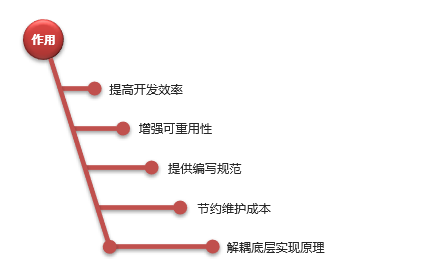
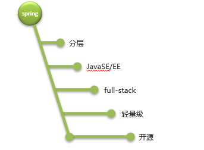
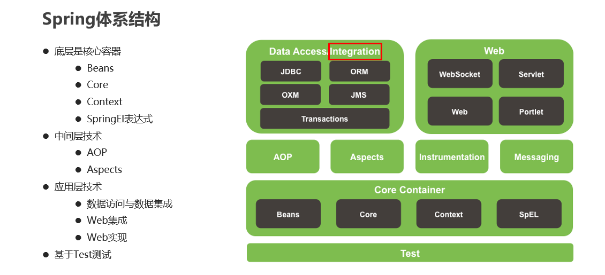
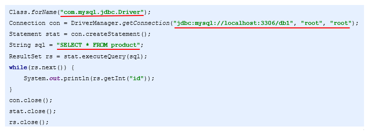
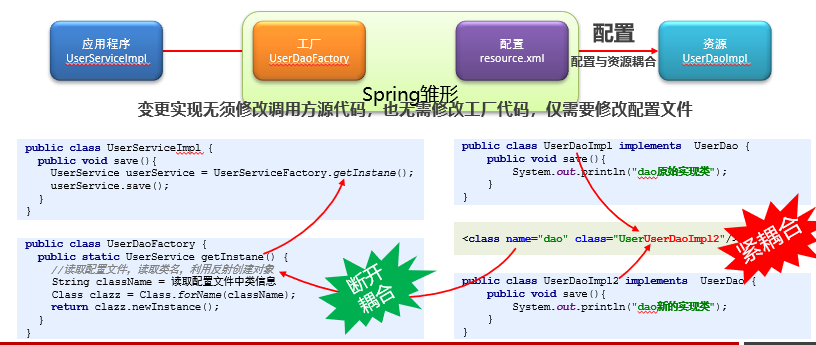

# Spring-day01   IoC

## 1)Spring简介

### 1.1)什么是框架

- 源自于建筑学，隶属土木工程，后发展到软件工程领域

- 软件工程框架：经过验证的，具有一定功能的，半成品软件

  - 经过验证

  - 具有一定功能

  - 半成品


### 1.2)框架的作用



### 1.3)Spring是什么

Spring是分层的JavaSE/EE应用full-stack轻量级开源框架



### 1.4)Spring的体系结构



### 1.5)Spring的发展历史


### 1.6)Spring优势

| Spring的优势             |          |
| ———————— | ——— |
| 方便解耦，简化开发       | 第一天   |
| 方便集成各种优秀框架     | 第一天   |
| 方便程序的测试           | 第二天   |
| AOP编程的支持            | 第三天   |
| 声明式事务的支持         | 第四天   |
| 降低JavaEE API的使用难度 | 第四天   |
| Java源码是经典学习范例   | 长期学习 |

## 2)IoC简介

### 2.1)优质程序代码的制作原则



### 2.2)耦合与内聚

- 耦合（Coupling）：代码书写过程中所使用技术的结合紧密度，用于衡量软件中各个模块之间的互联程度

- 内聚（Cohesion）：代码书写过程中单个模块内部各组成部分间的联系，用于衡量软件中各个功能模块内部的功能联系


- 程序书写的目标：高内聚，低耦合
  - 就是同一个模块内的各个元素之间要高度紧密，但是各个模块之间的相互依存度却不要那么紧密

### 2.3)工厂模式发展史




### 2.4)Spring发展历程


### 2.5)IoC

- IoC（Inversion Of Control）控制反转，Spring反向控制应用程序所需要使用的外部资源

- Spring控制的资源全部放置在Spring容器中，该容器称为IoC容器

  


## 3)入门案例

### 3.1)案例环境说明

- 模拟三层架构中表现层调用业务层功能

  - 表现层：UserApp模拟UserServlet（使用main方法模拟）

  - 业务层：UserService

### 3.2)IoC入门案例制作步骤

1.导入spring坐标（5.1.9.release）

2.编写业务层与表现层（模拟）接口与实现类

3.建立spring配置文件

4.配置所需资源（Service）为spring控制的资源

5.表现层（App）通过spring获取资源（Service实例）


#### 3.2.1)IoC入门案例制作步骤-1

```xml
<dependency>
    <groupId>org.springframework</groupId>
    <artifactId>spring-context</artifactId>
    <version>5.1.9.RELEASE</version>
</dependency>
```

#### 3.2.2)IoC入门案例制作步骤-2

```java
public interface UserService {
	//业务方法  
	void save();
}
```

#### 3.2.3)IoC入门案例制作步骤-3

```java
public class UserServiceImpl implements UserService {
    public void save() {
        System.out.println(“user service running...”);
    }
}
```

#### 3.2.4)IoC入门案例制作步骤-4

```xml
<?xml version=“1.0” encoding=“UTF-8”?>
<beans xmlns=“http://www.springframework.org/schema/beans”
       xmlns:xsi=“http://www.w3.org/2001/XMLSchema-instance”
       xsi:schemaLocation=“http://www.springframework.org/schema/beans
        https://www.springframework.org/schema/beans/spring-beans.xsd”>
    <!— 1.创建spring控制的资源—>
    <bean id=“userService” class=“com.itheima.service.impl.UserServiceImpl”/>
</beans>
```

#### 3.2.5)IoC入门案例制作步骤-5

```java
public class UserApp {
    public static void main(String[] args) {
        //2.加载配置文件
        ApplicationContext ctx = new ClassPathXmlApplicationContext(“applicationContext.xml”);
        //3.获取资源
        UserService userService = (UserService) ctx.getBean(“userService”);
        userService.save();
    }
}
```

## 4)IoC配置（XML格式）

### 4.1)bean

- 名称：bean

- 类型：**标签**

- 归属：beans标签

- 作用：定义spring中的资源，受此标签定义的资源将受到spring控制

- 格式：

  ```xml
  <beans>
  	<bean />
  </beans>
  ```

- 基本属性：

  ```xml
  <bean id=“beanId” name=“beanName1,beanName2” class=“ClassName”></bean>
  ```

  ​	id：bean的名称，通过id值获取bean

  ​	class：bean的类型

  ​	name：bean的名称，可以通过name值获取bean，用于多人配合时给bean起别名

### 4.2)bean属性scope

- 名称：scope

- 类型：**属性**

- 归属：bean标签

- 作用：定义bean的作用范围

- 格式：

  ```xml
  <bean scope=“singleton”></bean>
  ```

- 取值：

  - singleton：设定创建出的对象保存在spring容器中，是一个单例的对象
  - prototype：设定创建出的对象保存在spring容器中，是一个非单例的对象
  - request、session、application、 websocket ：设定创建出的对象放置在web容器对应的位置

### 4.3)bean生命周期

- 名称：init-method，destroy-method

- 类型：**属性**

- 归属：bean标签

- 作用：定义bean对象在初始化或销毁时完成的工作

- 格式：

  ```xml
  <bean init-method=“init” destroy-method=“destroy></bean>
  ```

- 取值：bean对应的类中对应的具体方法名

- 注意事项：

  - 当scope=“singleton”时，spring容器中有且仅有一个对象，init方法在创建容器时仅执行一次

  - 当scope=“prototype”时，spring容器要创建同一类型的多个对象，init方法在每个对象创建时均执行一次

  - 当scope=“singleton”时，关闭容器会导致bean实例的销毁，调用destroy方法一次

  - 当scope=“prototype”时，对象的销毁由垃圾回收机制gc()控制，destroy方法将不会被执行

### 4.4)bean对象创建方式（了解）

(1)factory-bean

- 名称：factory-bean

- 类型：**属性**

- 归属：bean标签

- 作用：定义bean对象创建方式，使用静态工厂的形式创建bean，兼容早期遗留系统的升级工作

- 格式：

  ```xml
  <bean class=“FactoryClassName” factory-method=“factoryMethodName”></bean>
  ```

- 取值：工厂bean中用于获取对象的静态方法名

- 注意事项：
  
  - class属性必须配置成静态工厂的类名

(2)factory-bean，factory-method

- 名称：factory-bean，factory-method

- 类型：**属性**

- 归属：bean标签

- 作用：定义bean对象创建方式，使用实例工厂的形式创建bean，兼容早期遗留系统的升级工作

- 格式：

  ```xml
  <bean factory-bean=“factoryBeanId” factory-method=“factoryMethodName”></bean>
  ```

- 取值：工厂bean中用于获取对象的实例方法名

- 注意事项：

  - 使用实例工厂创建bean首先需要将实例工厂配置bean，交由spring进行管理

  - factory-bean是实例工厂的beanId

### 4.5)DI

- IoC（Inversion Of Control）控制翻转，Spring反向控制应用程序所需要使用的外部资源

- DI（Dependency Injection）依赖注入，应用程序运行依赖的资源由Spring为其提供，资源进入应用程序的方式称为注入


IoC与DI的关系

- IoC与DI是同一件事站在不同角度看待问题

- 半杯水

- 

- 

  set注入（主流）

### 4.6)set注入（主流）

- 名称：property

- 类型：**标签**

- 归属：bean标签

- 作用：使用set方法的形式为bean提供资源

- 格式：

  ```java
  <bean>
  	<property />
  </bean>
  ```

- 基本属性：

  ```xml
  <property name=“propertyName” value=“propertyValue” ref=“beanId”/>
  ```

​	name：对应bean中的属性名，要求该属性必须提供可访问的set方法（严格规范为此名称是set方法对应名称）

​	value：设定非引用类型属性对应的值，不能与ref同时使用

​	ref：设定引用类型属性对应bean的id ，不能与value同时使用

- 注意：一个bean可以有多个property标签

### 4.7)构造器注入（了解）

- 名称：constructor-arg

- 类型：**标签**

- 归属：bean标签

- 作用：使用构造方法的形式为bean提供资源，兼容早期遗留系统的升级工作

- 格式：

  ```xml
  <bean>
  	<constructor-arg />
  </bean>
  ```

- 基本属性：

  ```xml
  <constructor-arg name=“argsName” value=“argsValue />
  ```

​	name：对应bean中的构造方法所携带的参数名

​	value：设定非引用类型构造方法参数对应的值，不能与ref同时使用

其他属性：

```xml
<constructor-arg index=“arg-index” type=“arg-type” ref=“beanId”/>
```

​	ref：设定引用类型构造方法参数对应bean的id ，不能与value同时使用

​	type ：设定构造方法参数的类型，用于按类型匹配参数或进行类型校验

​	index ：设定构造方法参数的位置，用于按位置匹配参数，参数index值从0开始计数

- 注意：一个bean可以有多个constructor-arg标签

### 4.8)集合类型数据注入

- 名称：array，list，set，map，props

- 类型：**标签**

- 归属：property标签 或 constructor-arg标签

- 作用：注入集合数据类型属性

- 格式：

  ```xml
  <property>
  	<list></list>
  </property>
  ```

(1)集合类型数据注入——list

```xml
<property name=“al”>
    <list>
        <value>itheima</value>
        <value>66666</value>
    </list>
</property>
```

(2)集合类型数据注入——props

```xml
<property name=“properties”>
    <props>
        <prop key=“name”>itheima666</prop>
        <prop key=“value”>666666</prop>
    </props>
</property>
```

(3)集合类型数据注入——array （了解）

```xml
<property name=“arr”>
    <array>
        <value>123456</value>
        <value>66666</value>
    </array>
</property>
```

(4)集合类型数据注入——set（了解）

```xml
 <property name=“hs”>
     <set>
         <value>itheima</value>
         <value>66666</value>
     </set>
</property>
```

(5)集合类型数据注入——map（了解）

```xml
<property name=“hm”>
    <map>
        <entry key=“name” value=“itheima66666”/>
        <entry key=“value” value=“6666666666”/>
    </map>
</property>
```

### 4.9)使用p命名空间简化配置（了解）

- 名称：p:propertyName，p:propertyName-ref

- 类型：**属性**

- 归属：bean标签

- 作用：为bean注入属性值

- 格式：

  ```xml
  <bean p:propertyName=“propertyValue” p:propertyName-ref=“beanId”/>
  ```

- 注意：使用p命令空间需要先开启spring对p命令空间的的支持，在beans标签中添加对应空间支持

  ```xml
  <beans xmlns=“http://www.springframework.org/schema/beans”    xmlns:xsi=“http://www.w3.org/2001/XMLSchema-instance”    xmlns:p=“http://www.springframework.org/schema/p”       xsi:schemaLocation=“http://www.springframework.org/schema/beans     https://www.springframework.org/schema/beans/spring-beans.xsd”>
  ```

  后续课程中还将开启其他的命名空间，方式同上

- 案例：

  ```xml
   <bean
         id=“userService”
         class=“com.itheima.service.impl.UserServiceImpl”
         p:userDao-ref=“userDao”
         p:bookDao-ref=“bookDao”
         />
  ```

  

### 4.10)SpEL （了解）

- Spring提供了对EL表达式的支持，统一属性注入格式

- 类型：**属性值**

- 归属：value属性值

- 作用：为bean注入属性值

- 格式：

  ```xml
  <property value=“EL”></bean>
  ```

- 注意：所有属性值不区分是否引用类型，统一使用value赋值

- 所有格式统一使用  value=“********”

  - 常量  #{10}  #{3.14}  #{2e5}  #{‘itcast’}

  - 引用bean  #{beanId}    

  - 引用bean属性  #{beanId.propertyName}

  - 引用bean方法  beanId.methodName().method2()

  - 引用静态方法  T(java.lang.Math).PI

  - 运算符支持  #{3 lt 4 == 4 ge 3}

  - 正则表达式支持  #{user.name matches‘[a-z]{6,}’}

  - 集合支持  #{likes[3]}

- 案例：

  ```xml
   <bean id=“userService” class=“com.itheima.service.impl.UserServiceImpl”>
       <property name=“userDao” value=“#{userDao}”/>
       <property name=“bookDao” value=“#{bookDao}”/>
       <property name=“num” value=“#{666666666}”/>
       <property name=“version” value=“#{‘itcast’}”/>
  </bean>
  ```

### 4.11)properties文件

- Spring提供了读取外部properties文件的机制，使用读取到的数据为bean的属性赋值

- 操作步骤

  1.准备外部properties文件

  2.开启context命名空间支持

  ```xml
  xmlns:context=“http://www.springframework.org/schema/context”
  ```

​		3.加载指定的properties文件

```xml
<context:property-placeholder location=“classpath:filename.properties”>
```

​		4.使用加载的数据

```xml
<property name=“propertyName” value=“${propertiesName}”/>
```

- 注意：如果需要加载所有的properties文件，可以使用`*.properties`表示加载所有的properties文件

- 注意：读取数据使用**${propertiesName}**格式进行，其中**propertiesName**指properties文件中的属性名

### 4.12)团队开发

- 名称：import

- 类型：**标签**

- 归属：beans标签

- 作用：在当前配置文件中导入其他配置文件中的项

- 格式：

  ```xml
  <beans>
      <import />
  </beans>
  ```

- 基本属性：

  ```xml
  <import resource=“config.xml”/>
  ```

​	resource：加载的配置文件名

- Spring容器加载多个配置文件

  ```java
  new ClassPathXmlApplicationContext(“config1.xml”,”config2.xml”);
  ```

- Spring容器中的bean定义冲突问题

  - 同id的bean，后定义的覆盖先定义的

  - 导入配置文件可以理解为将导入的配置文件复制粘贴到对应位置

  - 导入配置文件的顺序与位置不同可能会导致最终程序运行结果不同

### 4.13)ApplicationContext

1.ApplicationContext是一个接口，提供了访问spring容器的API

2.ClassPathXmlApplicationContext是一个类，实现了上述功能

3.ApplicationContext的顶层接口是BeanFactory

4.BeanFactory定义了bean相关的最基本操作

5.ApplicationContext在BeanFactory基础上追加了若干新功能

**对比BeanFactory**

1.BeanFactory创建的bean采用延迟加载形式，使用才创建

2.ApplicationContext创建的bean默认采用立即加载形式

**FileSystemXmlApplicationContext**

可以加载文件系统中任意位置的配置文件，而ClassPathXmlApplicationContext只能加载类路径下的配置文件


**BeanFactory**

```java
Resource res = new ClassPathResource("applicationContext.xml");
BeanFactory bf = new XmlBeanFactory(res);
UserService userService = (UserService)bf.getBean("userService");
```

### 4.14)第三方资源配置

- 阿里数据源方案Druid

  ```xml
  <bean id="dataSource" class="com.alibaba.druid.pool.DruidDataSource">
      <property name="driverClassName" value="com.mysql.jdbc.Driver"></property>
      <property name="url" value="jdbc:mysql://localhost:3306/spring_ioc"></property>
      <property name="username" value="root"></property>
      <property name="password" value="root"></property>
  </bean>
  
  ```

## 5)综合案例

### **5.1)案例介绍**

- 使用spring整合mybatis技术，完成账户模块（Account）的基础增删改查功能

- 账户模块对应字段

  - 编号：id

  - 账户名：name

  - 余额：money

### **5.2)案例分析**

非spring环境

1.实体类与表

2.业务层接口与实现

3.数据层接口

4.Mybatis核心配置

5.Mybatis映射配置

6.客户端程序测试功能


spring环境

1.实体类与表

2.业务层接口与实现（提供数据层接口的注入操作）

3.数据层接口

4.Mybatis核心配置（交给spring控制，该文件省略）

5.Mybatis映射配置

6.客户端程序测试功能（使用spring方式获取bean）

7.Spring核心配置文件

8.Druid数据源的应用（可选）

9.Spring整合MyBatis


### 5.3)案例制作步骤——基础准备工作

- 环境准备

1.导入Spring坐标，MyBatis坐标，MySQL坐标，Druid坐标

- 业务类与接口准备

2.创建数据库表，并制作相应的实体类Account

3.定义业务层接口与数据层接口

4.在业务层调用数据层接口，并实现业务方法的调用

- 基础配置文件

5.jdbc.properties

6.MyBatis映射配置文件

### 5.4)案例制作步骤——整合准备工作

- 整合前基础准备工作

1.spring配置文件，加上context命名空间，用于加载properties文件

2.开启加载properties文件

3.配置数据源druid（备用）

4.定义service层bean，注入dao层bean

5.dao的bean无需定义，使用代理自动生成

### 5.5)案例制作步骤——整合工作

- 整合工作

1.导入Spring整合MyBatis坐标

2.将mybatis配置成spring管理的bean（SqlSessionFactoryBean）

​	-将原始配置文件中的所有项，转入到当前配置中

​	数据源转换

​	映射转换

3.通过spring加载mybatis的映射配置文件到spring环境中

4.设置类型别名

- 测试结果

5.使用spring环境加载业务层bean，执行操作

### **小节**

- 需要专用的spring整合mybatis的jar包

- Mybatis核心配置文件消失

  - 环境environment转换成数据源对象

  - 映射Mapper扫描工作交由spring处理

  - 类型别名交由spring处理

- 业务发起使用spring上下文对象获取对应的bean

