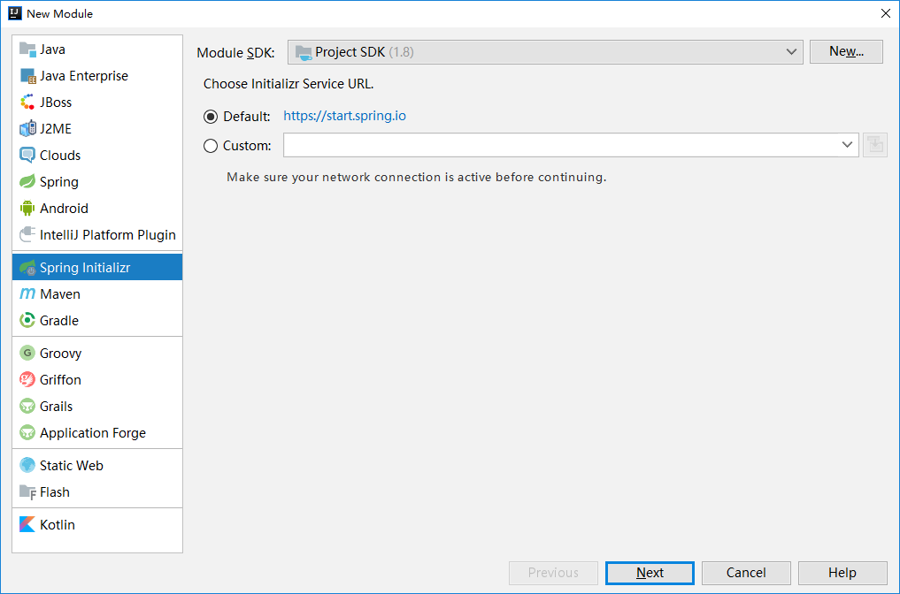

## **01-今日内容**

- Spring概述、快速入门
- SpringBoot配置
- SpringBoot整合

## **02-SpringBoot概述**

 SpringBoot提供了一种快速使用Spring的方式，基于约定优于配置的思想，可以让开发人员不必在配置与逻辑业务之间进行思维的切换，全身心的投入到逻辑业务的代码编写中，从而大大提高了开发的效率

**SpringBoot功能**

 **1**） **自动配置**

Spring Boot的自动配置是一个运行时（更准确地说，是应用程序启动时）的过程，考虑了众多因素，才决定Spring配置应该用哪个，不该用哪个。该过程是SpringBoot自动完成的。

**2**） **起步依赖**

起步依赖本质上是一个Maven项目对象模型（Project Object Model，POM），定义了对其他库的传递依赖，这些东西加在一起即支持某项功能。

简单的说，起步依赖就是将具备某种功能的坐标打包到一起，并提供一些默认的功能。

**3**） **辅助功能**

提供了一些大型项目中常见的非功能性特性，如嵌入式服务器、安全、指标，健康检测、外部配置等。


**注意：Spring Boot 并不是对 Spring 功能上的增强，而是提供了一种快速使用 Spring 的方式。**

## **03-SpringBoot快速入门**

 **需求**：搭建SpringBoot工程，定义HelloController.hello()方法，返回”Hello SpringBoot!”。

**实现步骤**：

①创建Maven项目

②导入SpringBoot起步依赖

```xml
<!—springboot工程需要继承的父工程—>
    <parent>
        <groupId>org.springframework.boot</groupId>
        <artifactId>spring-boot-starter-parent</artifactId>
        <version>2.1.8.RELEASE</version>
    </parent>

    <dependencies>
        <!—web开发的起步依赖—>
        <dependency>
            <groupId>org.springframework.boot</groupId>
            <artifactId>spring-boot-starter-web</artifactId>
        </dependency>
    </dependencies>
```

③定义Controller

```java
@RestController
public class HelloController {

    @RequestMapping(“/hello”)
    public String hello(){
        return “ hello Spring Boot !”;
    }
}

```

④编写引导类

```java
/**
 * 引导类。 SpringBoot项目的入口
 */
@SpringBootApplication
public class HelloApplication {

    public static void main(String[] args) {
        SpringApplication.run(HelloApplication.class,args);
    }
}

```

⑤启动测试

## **04-快速构建SpringBoot工程**




 


## 05-SpringBoot起步依赖原理分析

- 在spring-boot-starter-parent中定义了各种技术的版本信息，组合了一套最优搭配的技术版本。

- 在各种starter中，定义了完成该功能需要的坐标合集，其中大部分版本信息来自于父工程。

- 我们的工程继承parent，引入starter后，通过依赖传递，就可以简单方便获得需要的jar包，并且不会存在版本冲突等问题。

## **06-SpringBoot配置-配置文件分类**

SpringBoot是基于约定的，所以很多配置都有默认值，但如果想使用自己的配置替换默认配置的话，就可以使用application.properties或者application.yml（application.yaml）进行配置。

1. 默认配置文件名称：application

2. 在同一级目录下优先级为：properties>yml > yaml

例如：配置内置Tomcat的端口

properties：

```properties
server.port=8080
```

yml:

```yaml
server: port: 8080

```

## **07-SpringBoot配置-yaml基本语法**

- 大小写敏感
- 数据值前边必须有空格，作为分隔符
- 使用缩进表示层级关系
- 缩进时不允许使用Tab键，只允许使用空格（各个系统 Tab对应的 空格数目可能不同，导致层次混乱）。
- 缩进的空格数目不重要，只要相同层级的元素左侧对齐即可
- ‘’#” 表示注释，从这个字符一直到行尾，都会被解析器忽略。

```yaml
server: 
	port: 8080  
    address: 127.0.0.1
name: abc

```

## **08-SpringBoot配置-yaml数据格式**

**对象(map)**：键值对的集合。

```yaml
person:  
   name: zhangsan
# 行内写法
person: {name: zhangsan}

```

**数组**：一组按次序排列的值

```
address:
  - beijing
  - shanghai
# 行内写法
address: [beijing,shanghai]

```

**纯量**：单个的、不可再分的值

```yaml
msg1: ‘hello \n world’  # 单引忽略转义字符
msg2: “hello \n world”  # 双引识别转义字符

```

**参数引用**

```yaml
name: lisi 
person:
  name: ${name} # 引用上边定义的name值

```

## 09-SpringBoot配置-获取数据_1

@**Value**

```java
   #获取普通配置
   @Value(“${name}”)
    private String name;
    #获取对象属性
    @Value(“${person.name}”)
    private String name2;
   	#获取数组
    @Value(“${address[0]}”)
    private String address1;
  	#获取纯量
    @Value(“${msg1}”)
    private String msg1;

```

**Evironment**

```java
@Autowired
 private Environment env;

System.out.println(env.getProperty(“person.name”));

 System.out.println(env.getProperty(“address[0]”));

```

## **10-SpringBoot配置-获取数据_2**

 @ConfigurationProperties 

**注意**：prefix一定要写

```java
@Component
@ConfigurationProperties(prefix = “person”)
public class Person {

    private String name;
    private int age;
    private String[] address;

    public String getName() {
        return name;
    }

    public void setName(String name) {
        this.name = name;
    }

    public int getAge() {
        return age;
    }

    public void setAge(int age) {
        this.age = age;
    }

    public String[] getAddress() {
        return address;
    }

    public void setAddress(String[] address) {
        this.address = address;
    }

    @Override
    public String toString() {
        return “Person{“ +
                “name=‘” + name + ‘\’’ +
                “, age=“ + age +
                ‘}’;
    }
}
```

## **11-SpringBoot配置-profile**

1.  **profile是用来完成不同环境下，配置动态切换功能的**。

2.  **profile配置方式**

   ​	多profile文件方式：提供多个配置文件，每个代表一种环境。

   ​		application-dev.properties/yml 开发环境

   ​		application-test.properties/yml 测试环境

   ​		application-pro.properties/yml 生产环境

   ​    yml多文档方式：

​				在yml中使用  — 分隔不同配置

3.  **profile激活方式**

- 配置文件： 再配置文件中配置：spring.profiles.active=dev
- 虚拟机参数：在VM options 指定：-Dspring.profiles.active=dev
- 命令行参数：java –jar xxx.jar  —spring.profiles.active=dev

## **12-SpringBoot配置-项目内部配置文件加载顺序**

 加载顺序为上文的排列顺序，高优先级配置的属性会生效

- file:./config/：当前项目下的/config目录下
- file:./           ：当前项目的根目录
- classpath:/config/：classpath的/config目录
- classpath:/  ：classpath的根目录

## **13-SpringBoot配置-项目外部配置加载顺序**

 外部配置文件的使用是为了对能不文件的配合

1.命令行

```cmd
java -jar app.jar —name=“Spring“ —server.port=9000
```

2.指定配置文件位置

```cmd
 java -jar myproject.jar —spring.config.location=e://application.properties
```

3.外部不带profile的properties文件

```java
    classpath:/config/application.properties
    classpath:/application.properties
```


 https://docs.spring.io/spring-boot/docs/current/reference/html/spring-boot-features.html#boot-features-external-config


## **14-SpringBoot整合Junit**

1. 搭建SpringBoot工程

2.  引入starter-test起步依赖


```xml
 <dependencies>
        <dependency>
            <groupId>org.springframework.boot</groupId>
            <artifactId>spring-boot-starter</artifactId>
        </dependency>

        <dependency>
            <groupId>org.springframework.boot</groupId>
            <artifactId>spring-boot-starter-test</artifactId>
            <scope>test</scope>
        </dependency>
    </dependencies>
```

3. 编写测试类

```

/**
 * 测试类
 */

@RunWith(SpringRunner.class)
@SpringBootTest(classes = SpringbootJunitApplication.class )
public class UserServiceTest {

    @Test
    public void test(){
        System.out.println(111);
    }
}
```

4.测试

## **15-SpringBoot整合mybatis**

①搭建SpringBoot工程

②引入mybatis起步依赖，添加mysql驱动

```xml
<dependencies>
        <dependency>
            <groupId>org.mybatis.spring.boot</groupId>
            <artifactId>mybatis-spring-boot-starter</artifactId>
            <version>2.1.0</version>
        </dependency>

        <dependency>
            <groupId>mysql</groupId>
            <artifactId>mysql-connector-java</artifactId>
            <!--<scope>runtime</scope>-->
        </dependency>
        <dependency>
            <groupId>org.springframework.boot</groupId>
            <artifactId>spring-boot-starter-test</artifactId>
            <scope>test</scope>
        </dependency>
    </dependencies>
```

③编写DataSource和MyBatis相关配置

application.yml

```yaml
# datasource
spring:
  datasource:
    url: jdbc:mysql:///springboot?serverTimezone=UTC
    username: root
    password: root
    driver-class-name: com.mysql.cj.jdbc.Driver


# mybatis
mybatis:
  mapper-locations: classpath:mapper/*Mapper.xml # mapper映射文件路径
  type-aliases-package: com.itheima.springbootmybatis.domain

  # config-location:  # 指定mybatis的核心配置文件
```

④定义表和实体类

```
public class User {
    private int id;
    private String username;
    private String password;


    public int getId() {
        return id;
    }

    public void setId(int id) {
        this.id = id;
    }

    public String getUsername() {
        return username;
    }

    public void setUsername(String username) {
        this.username = username;
    }

    public String getPassword() {
        return password;
    }

    public void setPassword(String password) {
        this.password = password;
    }

    @Override
    public String toString() {
        return "User{" +
                "id=" + id +
                ", username='" + username + '\'' +
                ", password='" + password + '\'' +
                '}';
    }
}
```

⑤编写dao和mapper文件/纯注解开发

编写dao

```java
@Mapper
@Repository
public interface UserXmlMapper {

    public List<User> findAll();
}
```

mapper.xml

```xml
<?xml version="1.0" encoding="UTF-8" ?>
<!DOCTYPE mapper PUBLIC "-//mybatis.org//DTD Mapper 3.0//EN" "http://mybatis.org/dtd/mybatis-3-mapper.dtd">
<mapper namespace="com.itheima.springbootmybatis.mapper.UserXmlMapper">
    <select id="findAll" resultType="user">
        select * from t_user
    </select>
</mapper>
```

纯注解开发

```java
@Mapper
@Repository
public interface UserMapper {

    @Select("select * from t_user")
    public List<User> findAll();
}
```

⑥测试

## **16-SpringBoot整合redis**

①搭建SpringBoot工程

②引入redis起步依赖

```xml
  <dependencies>
        <dependency>
            <groupId>org.springframework.boot</groupId>
            <artifactId>spring-boot-starter-data-redis</artifactId>
        </dependency>

        <dependency>
            <groupId>org.springframework.boot</groupId>
            <artifactId>spring-boot-starter-test</artifactId>
            <scope>test</scope>
        </dependency>
    </dependencies>
```

③配置redis相关属性

```yaml
spring:
  redis:
    host: 127.0.0.1 # redis的主机ip
    port: 6379

```

④注入RedisTemplate模板

⑤编写测试方法，测试

```java
@RunWith(SpringRunner.class)
@SpringBootTest
public class SpringbootRedisApplicationTests {

    @Autowired
    private RedisTemplate redisTemplate;

    @Test
    public void testSet() {
        //存入数据
        redisTemplate.boundValueOps("name").set("zhangsan");
    }

    @Test
    public void testGet() {
        //获取数据
        Object name = redisTemplate.boundValueOps("name").get();
        System.out.println(name);
    }

}

```
